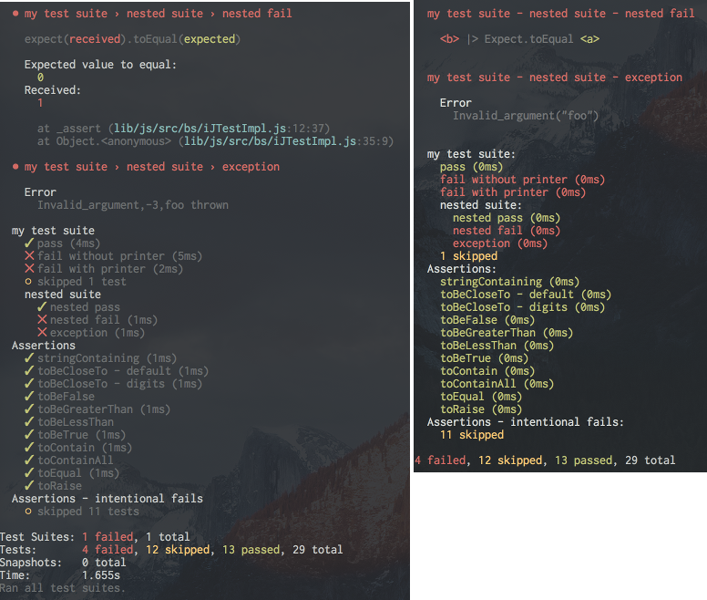

# infinite-jest

An experimental cross-platform native/BuckleScript test framework

> Alas, poor Yorick! I knew him, Horatio: a fellow of infinite jest, of most excellent fancy: he hath borne me on his back a thousand times; and now, how abhorred in my imagination it is!

## Example

```ml
open InfiniteJest

let myTests =
  open InfiniteJest.Test in
  
  describe "Assertions" (fun () -> [
  
    test "completely bananas" (fun () ->
      "bananas" |> Expect.stringContaining "nanas");
      
    test "succ" (fun () ->
      2 |> succ
        |> Expect.toEqual 3);
        
  ])

let _ = 
  run [myTests]
```

## Output comparison

Jest/BuckleScript (Left) vs Native runner (Right)
)
